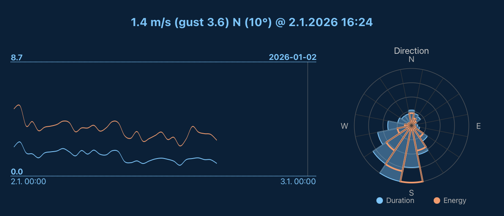

# SVG Visualizations for Vaadin

Lightweight, high-performance SVG visualization components for Vaadin 25+.



This project serves as a testing ground for the new SVG namespace support in Vaadin 25 and the SVG-specific elements in [Viritin 3.1](https://github.com/viritin/viritin). The components are actively used in a real-world weather monitoring application, handling datasets with nearly 1 million data points.

## Components

### SvgSparkLine

A lightweight SVG-based sparkline/line chart component optimized for large datasets.

**Features:**
- Multiple data series with custom colors
- Smoothing algorithms: None, Moving Average, RDP (Ramer-Douglas-Peucker)
- Interactive crosshair with position callbacks
- Timestamp/Instant-based data support
- Bezier curves or polyline rendering
- Fluid width (100%) or fixed dimensions
- Fixed or auto-fit x-axis range
- Min/max labels and time scale annotations

```java
SvgSparkLine sparkLine = new SvgSparkLine(500, 100);
sparkLine.setData(dataPoints); // List<DataPoint> with timestamps
sparkLine.setSmoothing(SvgSparkLine.Smoothing.RDP);
sparkLine.setLineColor(NamedColor.BLUE);
sparkLine.addSeries(secondaryData, NamedColor.RED);
sparkLine.setCrosshairListener(relPos -> {
    // Handle crosshair position (0.0 - 1.0)
});
```

### WindRose

A wind rose visualization for directional data distribution.

**Features:**
- Multiple data series (filled + outline styles)
- Configurable sector count (default: 16)
- Interactive clickable sectors with data callbacks
- Automatic legend generation
- Cardinal direction labels
- Reference circle grid

```java
WindRose windRose = new WindRose(300, 16);
windRose.addSeries("Duration", NamedColor.BLUE, durationBySector);
windRose.addSeries("Energy", NamedColor.RED, energyBySector);
windRose.setSectorClickListener(data -> {
    // Handle sector click with direction, values, percentages
});
windRose.draw();
```

## Performance Characteristics

These components are designed for high performance with large datasets. Benchmarks use real weather station data (~948,000 records at 1-minute resolution over 2 years).

### Rendering Performance

| Data Points | No Smoothing | Moving Average | RDP |
|-------------|--------------|----------------|-----|
| 10,000 | ~4 ms | ~1 ms | ~3 ms |
| 100,000 | ~16 ms | ~2 ms | ~2 ms |
| 948,000 | ~154 ms | ~21 ms | ~17 ms |

With smoothing enabled, render times remain under 25ms even for nearly 1 million points.

### Memory Efficiency

| Stage | Memory |
|-------|--------|
| Raw data (948k records) | ~20 MB |
| After smoothing | ~1.2 KB |
| After draw() | **~58 bytes** |

**Key optimization:** Data is cleared after rendering since SVG elements retain the visualization. This achieves essentially **zero session memory overhead** regardless of input size.

### Smoothing Algorithms

- **Moving Average**: Buckets data into ~50 points, averaging values per bucket. Best for noisy data.
- **RDP (Ramer-Douglas-Peucker)**: Preserves shape-significant points, removing redundant ones. Best for preserving peaks/valleys.
- **None**: Renders all points (use only for small datasets).

## Requirements

- Vaadin 25+
- Viritin 3.1+ (provides SVG element API)

## Installation

Add to your `pom.xml`:

```xml
<dependency>
    <groupId>org.vaadin</groupId>
    <artifactId>svg-visualizations</artifactId>
    <version>1.0-SNAPSHOT</version>
</dependency>
```

## Development

Run the `TestServer` class from your IDE to start the development server.

Run performance tests:

```bash
mvn test -Dtest=RenderingPerformanceTest
mvn test -Dtest=SessionWeightTest
```

**Note:** Test data (~240 MB) is downloaded automatically on first test run from a remote server.

## License

Apache License 2.0
